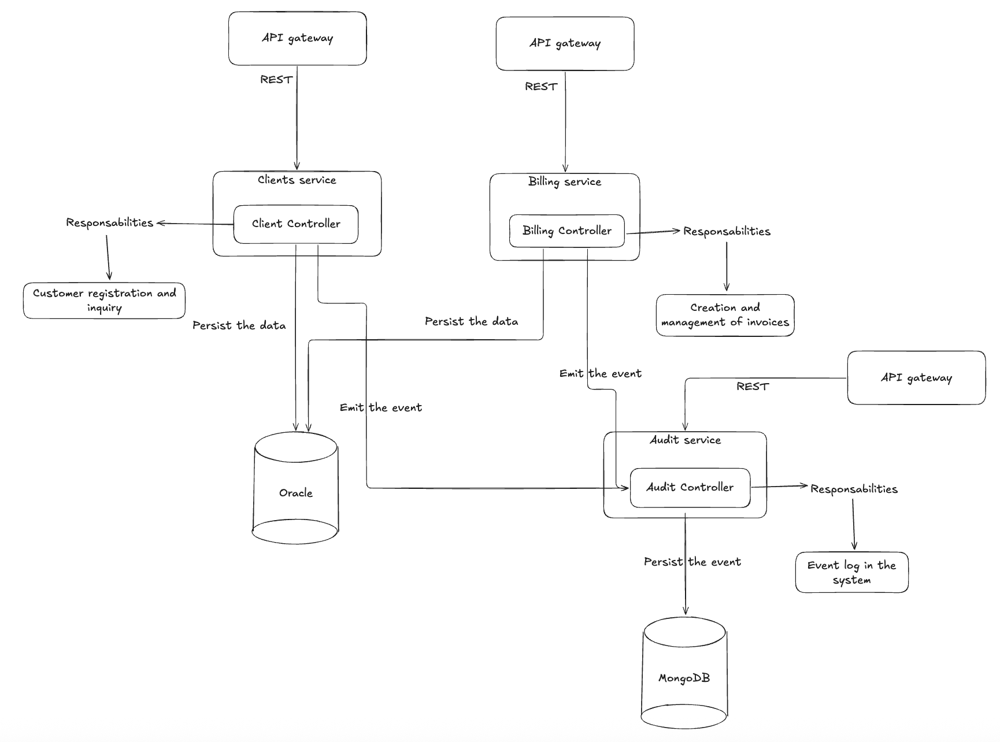

# 🏗️ Arquitectura del Sistema

Este documento describe en detalle la arquitectura del sistema de facturación basado en microservicios, explicando cómo se aplican los principios de **Microservicios**, **Clean Architecture** y **MVC**.

## 📐 Visión General

El sistema está compuesto por tres microservicios independientes que se comunican mediante HTTP REST:



## 🔄 Principios de Microservicios

### 1. Separación por Dominio

Cada microservicio gestiona un dominio de negocio específico:

- **Clients Service**: Dominio de gestión de clientes
  - Responsabilidad única: CRUD de clientes
  - Entidad principal: `Client`
  
- **Billing Service**: Dominio de facturación
  - Responsabilidad única: CRUD de facturas
  - Entidad principal: `Invoice`
  - Depende de: Clients Service (para validar clientes)
  
- **Audit Service**: Dominio de auditoría
  - Responsabilidad única: Registro de eventos del sistema
  - Entidad principal: `AuditLog`
  - Consumido por: Clients Service y Billing Service

### 2. Independencia de Bases de Datos

Cada servicio tiene su propia base de datos, permitiendo elegir la tecnología más adecuada:

| Servicio | Base de Datos | Justificación |
|----------|---------------|---------------|
| Clients Service | Oracle Database | Requiere transacciones ACID y relaciones complejas |
| Billing Service | Oracle Database | Comparte la misma base de datos Oracle (puede evolucionar a independiente) |
| Audit Service | MongoDB | Documentos flexibles, alta escritura, sin esquema fijo |

### 3. Comunicación entre Servicios

Los servicios se comunican mediante **HTTP REST** de forma síncrona:

#### Clients Service → Audit Service

El servicio de clientes utiliza la clase `AuditService` para registrar eventos. Cuando se crea un cliente, se envía una petición HTTP POST al servicio de auditoría con los datos del evento.

**Flujo:**
- El controlador crea el cliente exitosamente
- Llama a `AuditService.log_create` con los datos del cliente
- El servicio envía una petición HTTP POST al endpoint de auditoría
- El servicio de auditoría registra el evento en MongoDB

#### Billing Service → Clients Service

El servicio de facturación utiliza la clase `ClientsService` para validar que un cliente exista antes de crear una factura. Realiza una petición HTTP GET al servicio de clientes para verificar la existencia.

**Flujo:**
- El modelo de factura valida que el cliente exista
- Llama a `ClientsService.client_exists?` con el ID del cliente
- El servicio envía una petición HTTP GET al servicio de clientes
- Si el cliente existe, se procede con la creación de la factura

#### Billing Service → Audit Service

Similar a Clients Service, registra eventos de facturas.

### 4. Despliegue Independiente

Cada servicio:
- Tiene su propio `Dockerfile`
- Puede desplegarse independientemente
- Puede escalarse horizontalmente según necesidad
- Mantiene su propio ciclo de versionado

### 5. Tecnologías Heterogéneas

Aunque todos usan Ruby on Rails, cada servicio puede evolucionar independientemente:
- **Clients & Billing**: Rails 8.0.4
- **Audit**: Rails 7.1.0 (puede actualizarse sin afectar otros servicios)

## 🧹 Clean Architecture

Cada microservicio sigue los principios de Clean Architecture, organizando el código en capas bien definidas:

### Estructura de Capas

```
┌─────────────────────────────────────┐
│         Controllers Layer           │  ← Capa de Presentación
│  (HTTP Requests/Responses)          │
└──────────────┬──────────────────────┘
               │
┌──────────────▼──────────────────────┐
│         Services Layer               │  ← Capa de Aplicación
│  (Business Logic & Integration)      │
└──────────────┬──────────────────────┘
               │
┌──────────────▼──────────────────────┐
│         Models Layer                 │  ← Capa de Dominio
│  (Domain Entities & Validations)     │
└──────────────┬──────────────────────┘
               │
┌──────────────▼──────────────────────┐
│         Database Layer               │  ← Capa de Infraestructura
│  (Oracle / MongoDB)                  │
└─────────────────────────────────────┘
```

### 1. Capa de Presentación (Controllers)

**Responsabilidades:**
- Recibir peticiones HTTP
- Validar parámetros de entrada
- Orquestar llamadas a servicios
- Formatear respuestas JSON
- Manejar códigos de estado HTTP

**Flujo típico:**
- Recibe la petición HTTP con los parámetros
- Crea una instancia del modelo con los parámetros validados
- Intenta guardar el modelo
- Si es exitoso, llama al servicio de auditoría para registrar el evento
- Formatea y retorna una respuesta JSON con el resultado

**Características:**
- Delgados: Mínima lógica de negocio
- Reutilizan servicios para lógica compleja
- Manejan errores y respuestas HTTP

### 2. Capa de Aplicación (Services)

**Responsabilidades:**
- Contener lógica de negocio
- Comunicación entre servicios
- Transformación de datos
- Orquestación de operaciones complejas

**Funcionalidad:**
- Contiene métodos para comunicarse con otros servicios mediante HTTP
- Maneja timeouts y errores de conexión
- Registra logs de las operaciones realizadas
- Abstrae la complejidad de la comunicación HTTP

**Características:**
- Independientes del framework Rails
- Fáciles de testear en aislamiento
- Reutilizables entre controladores

### 3. Capa de Dominio (Models)

**Responsabilidades:**
- Representar entidades del dominio
- Validaciones de negocio
- Lógica de dominio
- Relaciones entre entidades

**Funcionalidad:**
- Define validaciones de negocio (presencia, unicidad, formato, rangos)
- Contiene callbacks para normalizar datos antes de guardar
- Define scopes para consultas frecuentes del dominio
- Encapsula la lógica específica de la entidad

**Características:**
- Contienen reglas de negocio
- Independientes de la infraestructura
- Fáciles de testear

### 4. Capa de Infraestructura (Database)

**Responsabilidades:**
- Persistencia de datos
- Configuración de conexiones
- Migraciones de esquema

**Independencia del Framework:**
- Los modelos usan Active Record, pero la lógica de negocio está en servicios
- Los servicios pueden abstraer la persistencia si es necesario

### Principios Aplicados

#### Dependencias Invertidas

```
Controller → Service → Model → Database
```

Los controladores dependen de servicios, no al revés. Los servicios dependen de modelos, pero la lógica de negocio está en servicios.

#### Separación de Responsabilidades

- **Controllers**: Solo HTTP
- **Services**: Lógica de negocio e integración
- **Models**: Entidades y validaciones
- **Database**: Solo persistencia

#### Testabilidad

Cada capa puede testearse independientemente:

- **Tests de Model**: Se prueban sin necesidad de HTTP ni servicios externos, solo validaciones y lógica de dominio
- **Tests de Service**: Se utilizan mocks de HTTP para simular las respuestas de servicios externos sin hacer peticiones reales
- **Tests de Controller**: Se utilizan mocks de servicios para aislar la lógica del controlador de las dependencias externas

## 🎯 Patrón MVC

Aunque es una API REST (sin vistas HTML), el patrón MVC se aplica adaptado:

### Model (Modelo)

**Ubicación:** `app/models/`

**Responsabilidades:**
- Representar datos y lógica de negocio
- Validaciones
- Relaciones entre entidades
- Consultas (scopes)

**Funcionalidad:**
- Define validaciones específicas del dominio (uniqueness, numericality, etc.)
- Utiliza callbacks para generar valores automáticamente (números de factura, cálculos)
- Proporciona scopes para filtrar por estados o relaciones (pending, by_client)

### View (Vista)

**En APIs REST, las "vistas" son respuestas JSON:**

**Formato estándar:**
Todas las respuestas JSON siguen un formato consistente que incluye:
- Campo `success`: Indica si la operación fue exitosa (true/false)
- Campo `data`: Contiene los datos de la respuesta
- Campo `message`: Mensaje descriptivo de la operación (opcional)
- Campos adicionales según el contexto (total_clients, total_invoices, etc.)

**Ejemplo de respuesta exitosa:**
```json
{
  "success": true,
  "data": {
    "id": 1,
    "name": "Juan Pérez",
    "email": "juan@example.com",
    "identification": "123456789",
    "address": "Calle 123",
    "created_at": "2024-01-01T00:00:00.000Z"
  },
  "message": "Cliente creado exitosamente"
}
```

**Ejemplo de respuesta con lista:**
```json
{
  "success": true,
  "data": [
    {
      "id": 1,
      "name": "Juan Pérez",
      "email": "juan@example.com"
    },
    {
      "id": 2,
      "name": "María García",
      "email": "maria@example.com"
    }
  ],
  "total_clients": 2
}
```

**Ejemplo de respuesta con error:**
```json
{
  "success": false,
  "message": "No se pudo crear el cliente",
  "errors": [
    "Email ya está registrado",
    "Name no puede estar vacío"
  ]
}
```

**Características:**
- Formato consistente en todos los endpoints
- Incluye metadatos (success, message, total)
- Filtra campos sensibles (except: [:updated_at])

### Controller (Controlador)

**Ubicación:** `app/controllers/api/v1/`

**Responsabilidades:**
- Recibir peticiones HTTP
- Validar parámetros
- Llamar a modelos y servicios
- Formatear respuestas JSON
- Manejar errores HTTP

**Flujo completo:**
- **Método index**: Obtiene todos los clientes, aplica filtros opcionales (búsqueda por nombre), y retorna la lista con el total
- **Método create**: Crea un nuevo cliente con los parámetros validados, si es exitoso registra el evento en auditoría y retorna el cliente creado, si falla retorna los errores de validación
- **Manejo de errores**: Cada método maneja diferentes escenarios (éxito, validación fallida, recurso no encontrado) con códigos HTTP apropiados

## 🔗 Flujos de Datos

### Flujo 1: Crear un Cliente

```
1. Cliente → POST /api/v1/clientes
2. ClientsController#create
3. Client.new(client_params)  [Model]
4. client.save
5. AuditService.log_create(...)  [Service]
6. HTTP POST → Audit Service
7. Audit Service guarda log en MongoDB
8. Response JSON al cliente
```

**Respuesta JSON al cliente:**
```json
{
  "success": true,
  "message": "Cliente creado exitosamente",
  "data": {
    "id": 1,
    "name": "Juan Pérez",
    "email": "juan@example.com",
    "identification": "123456789",
    "address": "Calle 123",
    "created_at": "2024-01-01T00:00:00.000Z"
  }
}
```

### Flujo 2: Crear una Factura

```
1. Cliente → POST /api/v1/facturas
2. InvoicesController#create
3. Invoice.new(invoice_params)  [Model]
4. Invoice#validate → client_must_exist
5. ClientsService.client_exists?(client_id)  [Service]
6. HTTP GET → Clients Service
7. Clients Service responde
8. Si cliente existe → invoice.save
9. AuditService.log_create(...)  [Service]
10. HTTP POST → Audit Service
11. Response JSON con factura + datos del cliente
```

**Respuesta JSON con factura y datos del cliente:**
```json
{
  "success": true,
  "message": "Factura creada exitosamente",
  "data": {
    "id": 1,
    "invoice_number": "INV-20240101-0001",
    "client_id": 1,
    "issue_date": "2024-01-01",
    "due_date": "2024-01-31",
    "subtotal": "1000.00",
    "tax": "190.00",
    "total": "1190.00",
    "status": "pending",
    "notes": "Servicios de consultoría",
    "created_at": "2024-01-01T00:00:00.000Z",
    "client": {
      "id": 1,
      "name": "Juan Pérez",
      "email": "juan@example.com"
    }
  }
}
```

### Flujo 3: Consultar Facturas con Datos del Cliente

```
1. Cliente → GET /api/v1/facturas
2. InvoicesController#index
3. Invoice.all  [Model]
4. Para cada factura:
   - ClientsService.find_client(invoice.client_id)  [Service]
   - HTTP GET → Clients Service
   - Agregar datos del cliente al JSON
5. Response JSON con facturas + clientes
```

**Respuesta JSON con lista de facturas y clientes:**
```json
{
  "success": true,
  "data": [
    {
      "id": 1,
      "invoice_number": "INV-20240101-0001",
      "client_id": 1,
      "issue_date": "2024-01-01",
      "subtotal": "1000.00",
      "tax": "190.00",
      "total": "1190.00",
      "status": "pending",
      "created_at": "2024-01-01T00:00:00.000Z",
      "client": {
        "id": 1,
        "name": "Juan Pérez",
        "email": "juan@example.com"
      }
    },
    {
      "id": 2,
      "invoice_number": "INV-20240102-0001",
      "client_id": 2,
      "issue_date": "2024-01-02",
      "subtotal": "500.00",
      "tax": "95.00",
      "total": "595.00",
      "status": "paid",
      "created_at": "2024-01-02T00:00:00.000Z",
      "client": {
        "id": 2,
        "name": "María García",
        "email": "maria@example.com"
      }
    }
  ],
  "total_invoices": 2
}
```

## 🗄️ Arquitectura de Bases de Datos

### Oracle Database (Clients & Billing)

**Esquema compartido:**
- Cada servicio tiene su propio esquema/usuario
- Pueden evolucionar a bases de datos separadas

**Tablas principales:**
- `clients` (Clients Service)
- `invoices` (Billing Service)

**Características:**
- Transacciones ACID
- Relaciones mediante foreign keys
- Migraciones con Active Record

### MongoDB (Audit)

**Colección principal:**
- `audit_logs`

**Estructura de documentos:**
Cada documento de log contiene:
- `_id`: Identificador único de MongoDB
- `resource_type`: Tipo de recurso auditado (client, invoice)
- `resource_id`: ID del recurso en su servicio original
- `action`: Acción realizada (create, read, update, delete, error)
- `changes_made`: Objeto con los cambios o datos relevantes
- `status`: Estado de la operación (success, failed)
- `error_message`: Mensaje de error si la operación falló
- `created_at`: Fecha y hora del evento

**Ejemplo de documento de log:**
```json
{
  "_id": {
    "$oid": "507f1f77bcf86cd799439011"
  },
  "resource_type": "client",
  "resource_id": "123",
  "action": "create",
  "changes_made": {
    "name": "Juan Pérez",
    "email": "juan@example.com"
  },
  "status": "success",
  "error_message": null,
  "created_at": "2024-01-01T00:00:00.000Z"
}
```

**Índices:**
- `resource_type + resource_id`
- `created_at` (descendente)
- `status + created_at`

**Ventajas:**
- Esquema flexible para diferentes tipos de logs
- Alta velocidad de escritura
- Escalabilidad horizontal

## 🐳 Arquitectura de Despliegue

### Docker Compose

```
┌──────────────────────────────────────┐
│         Docker Compose Network       │
│                                      │
│   ┌──────────┐  ┌──────────┐         │
│   │  Oracle  │  │ MongoDB  │         │
│   │  :1521   │  │ :27017   │         │
│   └────┬─────┘  └────┬─────┘         │
│        │             │               │
│   ┌────▼─────┐  ┌────▼─────┐         │
│   │ Clients  │  │  Billing │         │
│   │ :3000    │  │  :3001   │         │
│   └────┬─────┘  └────┬─────┘         │
│        │             │               │
│        └──────┬──────┘               │
│               │                      │
│         ┌─────▼─────┐                │
│         │   Audit   │                │
│         │   :3002   │                │
│         └───────────┘                │
└──────────────────────────────────────┘
```

### Comunicación Interna

Los servicios se comunican usando nombres de contenedor Docker:
- `http://clients:3000` (no `localhost`)
- `http://billing:3001`
- `http://audit:3002`

### Variables de Entorno

Cada servicio tiene su propio `.env`:
- Configuración de base de datos
- URLs de servicios externos
- Credenciales

## 🔒 Principios de Seguridad

### 1. Validación en Múltiples Capas

- **Controller**: Valida parámetros HTTP
- **Model**: Valida reglas de negocio
- **Service**: Valida antes de llamadas externas

### 2. Manejo de Errores

- Errores no exponen información sensible
- Logs de errores en Audit Service
- Timeouts en llamadas HTTP entre servicios

### 3. Aislamiento

- Cada servicio corre en su propio contenedor
- Bases de datos separadas
- No hay acceso directo entre servicios excepto por HTTP

## 📊 Escalabilidad

### Escalado Horizontal

Cada servicio puede escalarse independientemente configurando el número de réplicas en Docker Compose. Por ejemplo, el servicio de clientes puede tener 3 réplicas mientras que el de facturación tiene 2, dependiendo de la carga de trabajo esperada.

### Carga de Trabajo

- **Clients Service**: Lectura intensiva (consultas de clientes)
- **Billing Service**: Lectura/escritura balanceada
- **Audit Service**: Escritura intensiva (logs continuos)

## 🧪 Testabilidad

### Estrategia de Testing

1. **Unit Tests**: Models y Services (aislados)
2. **Integration Tests**: Controllers con mocks de servicios
3. **Contract Tests**: Comunicación entre servicios

### Estrategia de Testing Aislado

Para testear servicios que hacen llamadas HTTP, se utilizan mocks que simulan las respuestas sin hacer peticiones reales. Esto permite:
- Testear la lógica del servicio sin depender de servicios externos
- Verificar que se hacen las peticiones HTTP correctas con los parámetros adecuados
- Simular diferentes escenarios (éxito, error, timeout) de forma controlada

## 🔄 Evolución de la Arquitectura

### Posibles Mejoras Futuras

1. **Message Queue**: Para comunicación asíncrona entre servicios
2. **API Gateway**: Para enrutamiento y autenticación centralizada
3. **Service Mesh**: Para observabilidad y comunicación entre servicios
4. **CQRS**: Separar comandos y consultas en Billing Service
5. **Event Sourcing**: Para Audit Service (historial completo de eventos)

### Separación de Bases de Datos

Actualmente Clients y Billing comparten Oracle. Podrían separarse:
- Clients Service → PostgreSQL
- Billing Service → Oracle (requisitos de facturación)
